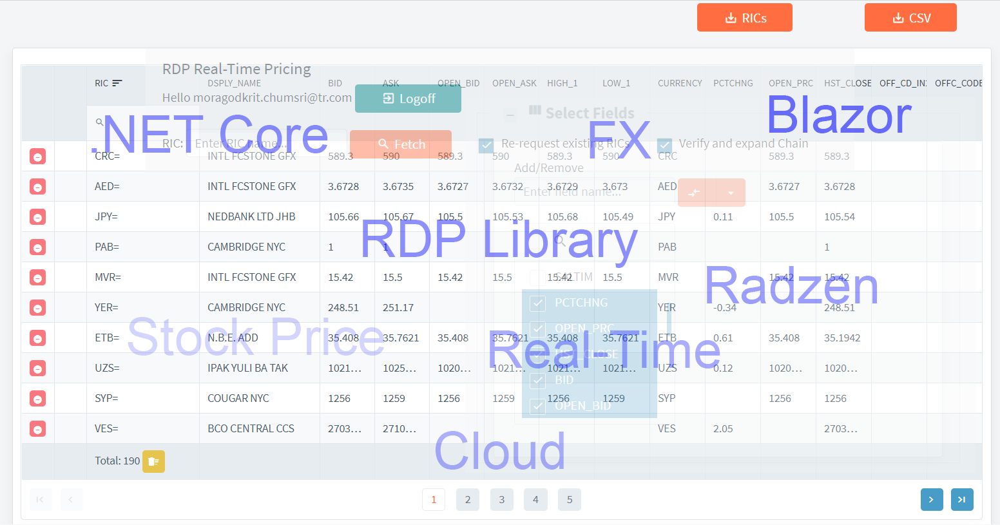
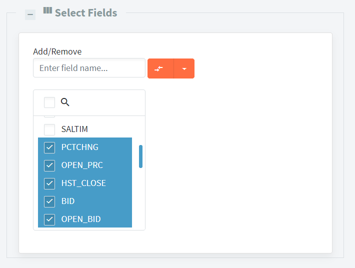
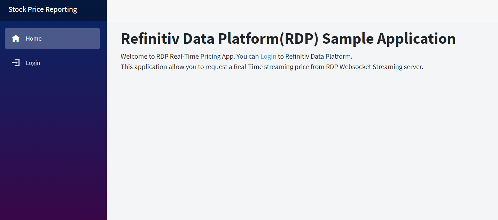
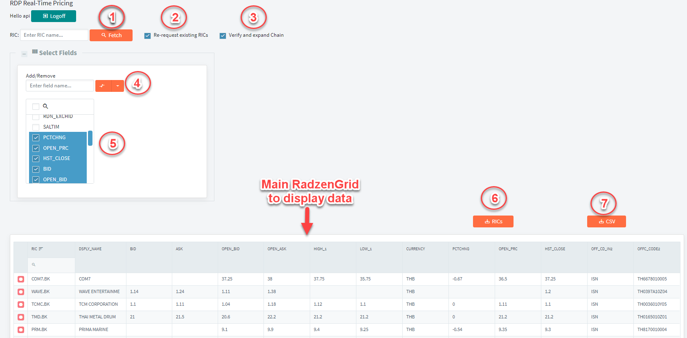

# Build .NET Core Blazor app to retrieve market price report using RDP Library

## Introduction 

This article is a consecutive series of use cases to demonstrate usage of the RDP library for .NET(RDP.NET). It will apply the core implementation from [the previous article](https://developers.refinitiv.com/article/displays-stock-price-real-time-web-using-aspnet-core-blazor-and-rdpnet) which uses RDP.NET to displaying a Real-Time Stock price update on the web. 

This article will provide an example of a web app created by using the ASP.NET Core Blazor framework and the RDP.NET to send a bulk request to get current stock prices from the ERT in cloud or local TREP server via a WebSocket connection. Users can use the app to send a bulk snapshot request to request data from the RIC list or Chain RIC and customize fields from the web UI and then leverage the functionality of RDP.NET to send snapshots with dynamic view request to get the data from the server. There is an option for a user to export the retrieved data to CSV files. The use case should be useful when users want to import the data to their system for reporting purposes or updating the price on their system or website. 

To achieve the requirement to support Chain RIC, we will create a separate .NET standard library to expand Chain RIC based on the implementation of [Example Websocket Chain Expander](https://developers.refinitiv.com/article/building-chain-expander-application-using-elektron-websocket-api-and-net-core-c) which we have created earlier.  We will migrate the Websocket connection manager inside the app to use the implementation of RDP.NET instead so that, it can support the connection to ERT in cloud. Then, we can call the method from the library to expand Chain and get a list of underlying RICs in the new web app.



## Prerequisites

* [.NET Core SDK 3.1(LTS)](https://dotnet.microsoft.com/download/dotnet-core) or higher.
* Visual Studio Code or [Visual Studio 2019](https://devblogs.microsoft.com/aspnet/blazor-webassembly-3-2-0-now-available/)(Ensure you have installed the latest release of Visual Studio 2019).
* Understand the basic usage of the Blazor application. You can read [Get Started guide](https://docs.microsoft.com/en-us/aspnet/core/blazor/?view=aspnetcore-3.1) from MSDN.
* Download example app and read the article ["Displays Stock price in Real-Time on the web using ASP.NET Core Blazor and RDP.NET"](https://developers.refinitiv.com/article/displays-stock-price-real-time-web-using-aspnet-core-blazor-and-rdpnet).
* Understand a concept to retrieve Chain RICs from the article ["Building a Chain Expander application using Elektron Websocket API and .NET Core C#"](https://developers.refinitiv.com/article/building-chain-expander-application-using-elektron-websocket-api-and-net-core-c).
* Understand how to use Refinitiv Data Platform (RDP) Libraries for .NET. Please find the guide from [RDP Libraries for .NET document](https://developers.refinitiv.com/refinitiv-data-platform/refinitiv-data-platform-libraries/quick-start) on the developer portal.
* Users must have RDP Account with permission to get Real-Time MarketPrice. Or TREP Server with WebSocket enabled with a valid DACS user. 

In this article, we will not talk about the basic concepts or usages of RDP Library for .NET and the ASP.NET Blazor. You can read the article mentioned in the above list to understand concepts with the sample usages.

## The main functionality of the Web application 

1) It can log on to the RDP server, or TREP depends on the network in which you host the web application.
2) It can retrieve a snapshot data of the level 1 Market Price via a WebSocket connection. 
3) It can request multiple RICs, and if one of the RIC is Chain RIC, the application can expand the Chain and return a list of underlying RICs. Please note that it does not support recursive Chain. 
4) Users can export the retrieved data to the CSV file.

Note that permission to retrieve or access the data depends on the  RDP account or DACS user preference.  

## Create a Chain Expander library

First of all, we will download the Chain Expander app from [GitHub](https://github.com/Refinitiv-API-Samples/Article.WebSocketAPI.DotNet.DotNetCoreChainExpanderApp). And then copy the ChainExpander project from the solution and add it to the new application. We will migrate the implementation to use RDP.NET instead.  

Considering the original constructor of the ChainExpander class.

```c#
 public ChainExpander(WebsocketConnectionClient websocketAdapter)
        {
            var websocketAdapter1 = websocketAdapter ?? throw new ArgumentNullException(nameof(websocketAdapter));
            _websocketMarketDataMgr = new WebsocketMarketDataManager(websocketAdapter);
            websocketAdapter1.MessageEvent += this.ProcessWebsocketMessage;
        }
```
The WebsocketConnectionClient is a wrapper class built on top of .NET Core ClientWebSocket class. We don't need to use it anymore because we will replace it with ISession from the RDP.NET library, which handles a Session and manage the underlying WebSocket connection. The main benefit of the ISession interface is that it can be used to connecting to either ERT in cloud or local TREP by changing the type of Session. Whereas, the old implementation can make a connection to WebSocket Server on local TREP only. The new implementation of the constructor is as follows:

```c#
 internal ISession _session =null;
 public class ChainExpander
 {
    public ChainExpander(ISession rdpsession)
        {
            _session = rdpsession;
            ///... initialize object
        }
 }
```

Then we will delete unnecessary functions from the class. Anyway we still use the old implementation of Chain expander function to handle a Refresh and a Status message from the JSON message returned by the RDP.NET. The RDP.NET can return the RAW JSON message like the implementation of the old application. Hence we can call the same function to deserialize the JSON message and extract underlying RICs from the Chain as usual.

Another primary function we have to modify is a function to send a snapshot request to get Chain Link fields. We will replace the old SendMarketPriceRequestAsync method with the new OpenSnapshot method, which utilizes the DeliveryFactory interface to create a new stream to request either snapshot or streaming request. The usage of the interface is more comfortable and shorter than the old codes.

The original codes:

```c#
await _websocketMarketDataMgr.SendMarketPriceRequestAsync(batchList.ToString(), _streamId, false).ConfigureAwait(false);
```

New method to send snapshot request:
```c#
 private async void OpenSnapshot(string ricName)
        {
            var itemParams = new ItemStream.Params().Session(_session)
                    .OnRefresh(ProcessRefresh)
                    .WithStreaming(false)
                    .OnStatus(ProcessStatus);

                var stream = DeliveryFactory.CreateStream(itemParams.Name(ricName));
                if (_streamCache.TryAdd(ricName, stream))
                {
                    await stream.OpenAsync().ConfigureAwait(false);
                }
               
        }
```

Next step we will create a helper function named IsChainRicAsync which can be used to determine if input RIC is a Chain. The application will utilize a snapshot request with a dynamic view to request RIC. The fields that application sends with a request come from the field list of the Chain Template. 

```c#
  public async Task<bool> IsChainRicAsync(string chainRic)
        {
            var isChainRic = false;
            var isComlete = false;
            await Task.Run(() =>
            {
                IEnumerable<string> chainTestFileds = new string[]
                {
                    "REF_COUNT", "LINK_1", "LINK_5", "LINK_14", "NEXT_LR", "PREV_LR", "LONGLINK1", "LONGLINK5",
                    "LONGLINK14", "LONGNEXTLR", "LONGPREVLR", "BR_LINK1", "BR_LINK5", "BR_LINK14", "BR_NEXTLR",
                    "BR_PREVLR"
                };
                ;
                var itemParams = new ItemStream.Params().Session(_session)
                    .WithStreaming(false)
                    .WithFields(chainTestFileds)
                    .OnRefresh((s, msg) =>
                    {
                        var message = msg.ToObject<MarketPriceRefreshMessage>();
                        if (message?.Fields != null)
                        {
                            var templateEnum = ChainUtils.GetChainTemplate(message.Fields);
                            if (templateEnum != ChainTemplateEnum.None)
                                isChainRic = true;
                        }
                        isComlete = true;
                    })
                    .OnStatus((s, msg) => { isComlete = true; });

                IStream stream = DeliveryFactory.CreateStream(itemParams.Name(chainRic));
                // Open the stream asynchronously and keep track of the task
                stream.OpenAsync();
             
            }).ConfigureAwait(true);
            while (!isComlete) ;
            return isChainRic;
        }
```

Below is a snippet of codes to demonstrate the usage of ChainExpander class to expand Chain RIC after initializing the session and the session state is open.

```c#
var _chainExpander = new ChainExpander(RdpSession.ServiceSession);
var isChain = _chainExpander.IsChainRicAsync(subRic.Trim()).GetAwaiter().GetResult();
if (isChain)
{
    var ricList = ExpandChainRicAsync(subRic).GetAwaiter().GetResult();
    //Add ricList to Subscription list.
}
else
    // Add RIC to the Subscription list.
```

## Implementing the main application

This section explains the implementation of the new application that supports dynamic field selection.

### Dynamic Data Caching and Data Processing

In this article, we will not re-create the Web application from scratch. Instead, we will modify the [RDPRealTimePrice app](https://github.com/Refinitiv-API-Samples/Example.RDPLibrary.DotNet.RdpRealTimePricing) to support new workflows. we will not touch the codes for the login page and functionality to display charts therefore it remains the same. What we are going to do is redesign the RadzenGrid to support dynamic columns based on user input and we use only snapshot requests to get data for a specified list of columns or fields name provided by the user.

In the previous example app, we construct a class to hold properties which is a fixed column we use to display in the RadzenGrid. But for this example, we will change the AppData class to hold the List of [ExpandoObject](https://docs.microsoft.com/en-us/dotnet/api/system.dynamic.expandoobject?view=netcore-3.1) instead. The ExpandoObject class enables you to dynamically add and delete and set or get the value of members of its instances at run time.

We will modify MarketPriceData from the previous example and rename it to a new MarketPriceReport class to hold the data. Below is the implementation of this class. The workflow to process data still is the same as the previous example app. Once the application receives a refresh message for each item, it will deserialize data to MarketPriceRefreshMessage class, and then create a new object from MarketPriceReport class. In the next step, the application will assign value to object members and set field data to the Fields property. 

After the application assigns value to Fields property, the internal codes will populate ExpandoObject from the Fields values. The app can access the ExpandoObject via DynamicFields property.

```c#
   public class MarketPriceReport:IMarketData
    {
        //...
        public string RicName { get; set; }
        public int? StreamId { get; set; }
        public IDictionary<string, JToken> _Attribute { get; set; }
        private IDictionary<string, dynamic> _fields;

        public IDictionary<string, dynamic> Fields
        {
            get => _fields;
            set
            {
                _fields = value;
                var item = new ExpandoObject();
                var dataItem = item as IDictionary<string, dynamic>;
                // Populate dynamic fields value in ExpandoObject
                if (Fields != null)
                {
                    foreach (var (key, val) in Fields)
                    {
                        dataItem.Add(key, val);
                    }
                }

                _dynamicFields = item;
            }
        }
        // Hold Dynamic Fields value in ExpandoObject
        private ExpandoObject _dynamicFields = new ExpandoObject();
        public ExpandoObject DynamicFields => _dynamicFields;
    }
```
We need to update DataCache property from the AppData class to use the ConcurrentDictionary object, which holds a key-value pair of the item name and MarketPriceReport object. This class is the main class to cache data, and the application will use it to binds value to RadzenGrid. 

```c#
 public class AppData
    {
        //...
        public ConcurrentDictionary<string, MarketPriceReport> DataCache{ get; set; }
        public IEnumerable<string> columnValues = new List<string> { "DSPLY_NAME", "BID", "ASK", "TRDPRC_1", };
    }
```
The columnValues variable is a list of field names from user input, we will set some initial value in the list, and the user can change it later. Below is a snippet of codes when the application process a Refresh Message for each RIC.

```c#
 private void OnRespMessage(object o, OnResponseMessageEventArgs e)
{
    //...
    switch (e.MessageType)
    {
        case MessageTypeEnum.Refresh:
        {
            // Process Refresh Message
            var refreshMessage = e.RespMessage as MarketPriceRefreshMessage;
            var itemName = refreshMessage.Key != null ? refreshMessage.Key.Name.FirstOrDefault() : string.Empty;
            if (refreshMessage.Fields != null)
            {
                var fxrateData = new MarketPriceReport();
                fxrateData.StreamId = refreshMessage.ID;
                fxrateData.RicName = itemName;
                // Assign a value to Fields to populate ExpandoObjects
                fxrateData.Fields = refreshMessage.Fields;  
                AppData.DataCache.AddOrUpdate(itemName, fxrateData, (oldkey, oldvalue) => fxrateData);
                //... 
            }
        }
    }
    //...                       
```

### Add UI to get dynamic columns from user

We will add RadzenListBox to the main UI. It is a component that shows a list of field names that users want to request. Also, the user can type field name in text input and add it to the list manually. Below is a snippet of codes to generate the component. 

The code on the main page also has variable __defaultFieldList__, which use to hold all fields available for the user. And user can manually add additional fields to the list later. The component will bind the selected field name from RadzenListBox to AppData.columnValues we created earlier.

```c#
<RadzenFieldset AllowCollapse="true" Style="@(_fieldSetVisible?"width:600px;margin-bottom:20px;height:450px":"width:600px;margin-bottom: 20px; height:5px")"
                Expand="@(() => FieldsetChange("expanded"))" Collapse="@(() => FieldsetChange("collapsed"))">
    <HeaderTemplate>
        <span>
            <RadzenIcon Icon="view_column" /><b style="font-size:20px">Select Fields</b>
        </span>
    </HeaderTemplate>
    <ChildContent>
        <RadzenCard Visible="@_fieldSetVisible" >
            <div class="row">
                <div class="col-md-12">
                    Add/Remove <br />
                    <RadzenTextBox Placeholder="Enter field name..." @bind-Value="AddRemoveField" Style="width: 200px;margin-bottom: 20px;" />
                    <RadzenSplitButton Click="@((args) => OnAddRemove(args, "AddRemoveBtn"))" Icon="compare_arrows" Style="margin-bottom: 20px;">
                        <ChildContent>
                            <RadzenSplitButtonItem Text="Add" Value="add" Icon="add_box" />
                            <RadzenSplitButtonItem Text="Remove" Value="remove" Icon="remove_circle" />
                        </ChildContent>
                    </RadzenSplitButton>
                    <br />
                    <RadzenListBox AllowFiltering="true" FilterCaseSensitivity="FilterCaseSensitivity.CaseInsensitive" @bind-Value="@AppData.columnValues" Multiple="true" Data="@defaultFieldList"
                                   Change="@(args => OnChange(args, "ListBox with multiple selection"))" Style="margin-bottom: 20px; height:250px;width:200px;" />

                    <br />

                </div>
            </div>
        </RadzenCard>
        </ChildContent>
    </RadzenFieldset>
```
Below is a sample output for the RadzenListBox UI.




### Dynamic Data Binding to RadzenGrid 

Next step, we need to modify the RadzenGrid component to generate the columns based on the field name from user input. The RadzenGrid is a table for display data,

First of all, we will change Data from original codes to bind to a list of MarketPriceReport instead. __AppData.DataCache.Values.ToList<MarketPriceReport>()__ 
and also need to set a type of item to MarketPriceReport.

```c#
  <RadzenGrid AllowFiltering="true" FilterCaseSensitivity="FilterCaseSensitivity.Default" AllowPaging="true"
    AllowSorting="true" Data="AppData.DataCache.Values.ToList<MarketPriceReport>()" TItem="MarketPriceReport" RowSelect="data => OnRowSelect(data)" ColumnWidth="100px;">
    ///... Generate Fixed and Dynamic Columns
   </RadzenGrid>
```

Then we will change the way to generate columns to dislay data. We will not use a fixed column name but generate it from the user-provided field name instead. The AppData.columnValues play the main role in these steps as the application need a list of field name from the columnValues to generates dynamic columns. 

A fixed column to display RIC name:
```c#
    <Columns>
    //... Generate Fixed columns to hold RIC name here
        <RadzenGridColumn TItem="MarketPriceReport" Property="RicName" Title="RIC" Width="140px">
            <FooterTemplate>
            @if (AppData.DataCache.Keys.Any())
            {
                <span>Total:</span>
                @string.Format($"{AppData.DataCache.Keys.Count}")
                <RadzenButton ButtonStyle="ButtonStyle.Warning" Icon="delete_sweep" Size="ButtonSize.Small" Click=@((args) => RemoveItem(null)) data-toggle="tooltip" data-placement="top" title="Remove all RIC"/>
            }
            </FooterTemplate>
        </RadzenGridColumn>
```

Generate Dynamic Columns:
```c#
//... Generate Dynamic Columns Here
@foreach (var key in AppData.columnValues.ToList<string>())
{
    if (key != null){
        <RadzenGridColumn Filterable="false" Sortable="false" TItem="MarketPriceReport" 
        Property="@key" Title="@key" Width="@(((string) key == "DSPLY_NAME") ? "150px" : "")">
            <Template Context="data">
            @{
                if (data != null)
                {
                    var priceValue = (data.DynamicFields as IDictionary<string, dynamic>);
                    if (priceValue.ContainsKey(key)){
                        <span>@(priceValue[key] != null ? priceValue[key] : string.Empty)</span>
                    }else{
                        <span>@(string.Empty)</span>
                    }
                }
            }
            </Template>
        </RadzenGridColumn>
        }
    }
</Columns>
                         
```

The following screen record represents how the dynamic columns work with the user input. It quite easy for the user when they want to generate reports from a specified field name. 


Note that, the list of field names from user input will map to field list that the application will pass to the dynamic view feature on the TREP server and ERT in cloud.

### Generate CSV file from data in the RadzenGrid

This section explains how the application generates a CSV file. Since the Web application is a server-side app, therefore we will create a Web API to make CSV data using ASP.NET Core. To pass data to the Web API, we will utilize dependency injection to access data from service when calling the Web API controller to generate data.

To pass data to the controller, we need to create a class to hold AppData that we need to export. It's a new class named ExportData.

```c#
public class ExportData
    {
        public ExportData()
        {
            RawData = new ConcurrentDictionary<string, AppData>();
        }
        public ConcurrentDictionary<string, AppData> RawData { get; set; }
    }
```
In Startup.cs file, add a singleton to register ExportData type to the service 

```c#
 public void ConfigureServices(IServiceCollection services)
        {
            // Add Singleton/Scoped/Transient
            services.AddSingleton<ExportData>();
        }
```

To start creating ExportController for the Web API. We also need to call endpoint.MapController in Startup.cs file.

```c#
  app.UseEndpoints(endpoints =>
            {
                endpoints.MapControllers(); // Add Controller for Web API controller
                endpoints.MapBlazorHub();
                endpoints.MapFallbackToPage("/_Host");
            });
```
And then create a method named CSV to export data to CSV file. It required username from the application to select the data to generate the report because if we have multiple users using the app at the same time it will have another user sharing the same object.

```c#
[Route("api/[controller]")]
    [ApiController]
    public class ExportController : ControllerBase
    {
       
        [HttpGet("[action]")]
        public FileResult CSV(string username)
        {
            // Get AppData from Service DI
            var services = this.HttpContext.RequestServices;
            var AppDataList = (ExportData)services.GetService(typeof(ExportData));
            byte[] data = new byte[] { };
            if (AppDataList.RawData.ContainsKey(username))
            {
                var AppData = AppDataList.RawData[username];
                using (var memroystream = new MemoryStream())
                using (var writer = new StreamWriter(memroystream))
                using (var csv = new CsvWriter(writer, CultureInfo.InvariantCulture))
                {
                    List<dynamic> records = new List<dynamic>();
                    foreach (var entry in AppData.DataCache.OrderBy(x=>x.Key).ToList())
                    {

                        var dataItem = new ExpandoObject() as IDictionary<string, dynamic>;
                        dataItem.Add("RIC", entry.Key);
                        foreach (var key in AppData.columnValues.ToList<string>())
                        {
                            var priceValue = (entry.Value.DynamicFields as IDictionary<string, dynamic>);
                            if (priceValue.ContainsKey(key))
                                dataItem.Add(key, priceValue[key]);
                            else
                                dataItem.Add(key, string.Empty);
                        }
                        records.Add(dataItem);

                    }
                    csv.WriteRecords(records);
                    writer.Flush();
                    data = memroystream.ToArray();

                }
            }
        
            AppDataList.RawData.TryRemove(username, out var removedData);
            return File(data, "text/csv", "ExportData.csv");

        }
    }
```
Then we will add a button to the main application to export the CSV file, and when the user clicks the button, it will call method ExportDataToCsvFile to generate CSV file from the web API controller.

```c#
void ExportDataToCsvFile()
    {

        ExportData.RawData[AppData.CurrentUserName] = AppData;
        NavigationManager.NavigateTo($"/api/Export/CSV?username={AppData.CurrentUserName}", true);

    }
```

## Build and Run Blazor Web Application

Please download the complete solution project from [GitHub](https://github.com/Refinitiv-API-Samples/Example.RDPLibrary.DotNet.RDPPriceReport)

__Build and Run the application using Visual Studio 2019__

* Open RdpPriceReport.sln with Visual Studio 2019 and then build the solution. Note that You can following the following [guide](https://docs.microsoft.com/en-us/aspnet/core/fundamentals/servers/kestrel?view=aspnetcore-3.1) to change the application to use Kestrel web server instead.

* Go to Debug and click __Start Debugging__ or __Start Without Debugging__.
 
On Windows, Visual Studio will start the IIS Express process and displays the main page for the web application. Then you can click Login to input RDP Login or use the local TREP WebSocket server.

__Build and Run the application using command line__

There are options for you to host the web application on Azure, Docker, Virtual Machines, and other cloud services. 

* For testing purpose, you can just run __dotnet run__ under folder RdpPriceReportApp which containing a project file.

* If you wish to host it on Azure, you can follow instructions from [Host and deploy ASP.NET Core](https://docs.microsoft.com/en-us/aspnet/core/host-and-deploy/?view=aspnetcore-3.1) to deploy it on Azure. But please note that when you host it on the Cloud, it runs on a different network, and you can not connect to the local TREP server in your local network. You can use only the RDP account. Anyway, for testing or development purposes, you can run below __dotnet__ command under folder RdpPriceReportApp to build the web application on a supported platform such as Windows, Linux, and macOS. 

```
dotnet publish -c release -r <platform> -o <output folder>
```
Sample command

```
dotnet publish -c release -r win10-x64 -o outputx64
```

* It will publish the web with executable files under folder outputx64 and then, you should see RdpPriceReportApp.exe in that folder.  Run the executable file, and it will start a web server and shows the following sample output. Please refer to [.NET Core RID Catalog](https://docs.microsoft.com/th-th/dotnet/core/rid-catalog) for the list of the platform supported by .NET Core SDK.

```c#
info: Microsoft.Hosting.Lifetime[0]
      Now listening on: http://localhost:5000
info: Microsoft.Hosting.Lifetime[0]
      Now listening on: https://localhost:5001
info: Microsoft.Hosting.Lifetime[0]
      Application started. Press Ctrl+C to shut down.
info: Microsoft.Hosting.Lifetime[0]
      Hosting environment: Production
info: Microsoft.Hosting.Lifetime[0]
      Content root path: D:\webroot\RdpPriceReportApp\outputx64
```
You can open https://localhost:5001 in the Chrome web browser, and it will show the Web Application first page like this.



You can click Login to use the web application. And it will route to the main application page. Below is a sample main page with the description for each bullet in the page.



**Bullet1** is a button for retrieve data. It will pass the RIC list that users enter in input text to the internal function. The format of the RIC list can be a comma separate string such as "MSFT.O,.AV.O, FX=,0#.SETI, VOD.L" or just a single RIC or Chain like "0#.SETI".

**Buttet2** is a checkbox for the case such as when user request first batch of RICs with fields "BID, ASK" and then they want to request a new RICs with "BID, ASK, TRDPRC_1, TRDPRC_DATE" it will reset all columns and re-request data for existing RICs. Uncheck it for the case that user does not want to re-request existing RICs and it will show only available fields cached in the ExpandoObject.

**Bullet3** is a checkbox to tell the app that it has to check if each RIC in the list is a Chain RIC or not. If it's Chain RIC it will call ChainExpander to expand Chain RIC and send underlying RICs to Subscription. Therefore, if your RIC list does not contain Chain RIC, please uncheck it before clicking the Fetch button. Chain validation is a time-consuming task. Uncheck it will get data faster than the default mode.

**Bullet4** is a button for Add or Remove fields to fields list. It's kind of SplitButtion so you have to click it first and it will show a menu Add/Remove. You can pass field lists in a comma separate string format. 

**Bullet5** is a list of field name user can change before request the data. The change also affects the column's name in RadzenGrid as well.

**Bullet6** is a button to export the current RIC list from the RadzenGrid to file. It will write the list to string in a  comma separate format. Next time you can just copy the list from a file and paste it to RIC input text and uncheck the "Verify and expand chain" checkbox to retrieve a data.

**Bullet7** is a button to export all data from RadzenGrid to CSV file. It will write data for each RIC in the list and column name would be the same as each column header from the Grid component.

The following screen is a sample usage of the application. 


There is some situation that another app is using port 5000 and 5001 on the same machine, so Kestrel unable to start. You can change the default port in file launchSettings.json, which locates in folder Properties. And change port in the following line to a new one.

```json
 "applicationUrl": "https://localhost:5001;http://localhost:5000"
```
## Notes

The performance and the speed of the Chain expanding process and data retrieving also depend on the performance of your machine or server(For example, CPU speed and amount of memory). It also depends on network latency between your computer and ERT in cloud or TREP server. Keep in mind that expanding very long Chain records will take a very long time to get all underlying RICs and retrieve data.

This application creates for demonstration purposes only, so we mixed all time-consuming tasks into the same process. Hence if you wish to implement and deploy this kind of use case on your production, we would recommend you move the Chain expanding process to a separate service on another server or process.  

## Summary

This article demonstrates how to use [RDP Library for .NET(RDP.NET)](https://developers.refinitiv.com/refinitiv-data-platform/refinitiv-data-platform-libraries) with the [ASP.NET Core Blazor framework](https://docs.microsoft.com/en-us/aspnet/core/blazor/get-started?view=aspnetcore-3.1&tabs=visual-studio) to develop a single page web application. It can be used to log in to the Refinitiv Data Platform(RDP) or local TREP server to retrieve a snapshot of Market Price data. The example also supports expanding Chain RIC from user input. And users can customize the fields or columns they want to display data in the UI. This example app uses the [Radzen Blazor component](https://blazor.radzen.com/get-started) to build web UI and shows the data in the RadzenGrid component. The web app also allows users to export the data to CSV file. 

The use case would be a benefit for the user that needs to import current Market Price data to their database or update the price such as the end of day close price on their system or show the data on their website. The web application can be run on a local machine, which is a Windows, Linux, and macOS or deploys it on the local server so other TREP users in the organization can access it. Or they can also deploy it on the cloud, such as Azure and AWS.

Base on our experiment, when the application sends and receives data across the internet, such as the case we connecting to ERT in the cloud, we should try to reduce the size of the response message as possible. The dynamic view will play the primary role in this case, the app should try to remove unnecessary fields from the request, and it should try to send a small set of fields when requesting a bulk request, and it should design to use snapshot requests as much as possible. Using this approach, we notice that the application gets the response message back faster than sending a request without a dynamic view. It also adds more benefits in terms of memory usage on the server.

## References

* [Article Displays Stock price using ASP.NET Core Blazor and RDP.NET](https://developers.refinitiv.com/article/displays-stock-price-real-time-web-using-aspnet-core-blazor-and-rdpnet)
* [Example Websocket Chain Expander](https://developers.refinitiv.com/article/building-chain-expander-application-using-elektron-websocket-api-and-net-core-c) 
* [The Refinitiv Data Platform Libraries for .NET (RDP.NET)](https://developers.refinitiv.com/refinitiv-data-platform/refinitiv-data-platform-libraries) 
* [The Introduction to RDP Libraries document](https://developers.refinitiv.com/refinitiv-data-platform/refinitiv-data-platform-libraries/docs?content=62446&type=documentation_item)
* [Refinitiv DataPlatform for .NET Nuget](https://www.nuget.org/packages/Refinitiv.DataPlatform/)
* [Refinitiv DataPlatform Content Nuget](https://www.nuget.org/packages/Refinitiv.DataPlatform.Content/)
* [Elektron WebSocket](https://developers.refinitiv.com/elektron/websocket-api/quick-start)
* [Refinitiv API Docs](https://apidocs.refinitiv.com/Apps/ApiDocs)
* [Radzen Blazor Components](https://blazor.radzen.com/get-started)
* [Get started with ASP.NET Core Blazor](https://docs.microsoft.com/en-us/aspnet/core/blazor/get-started?view=aspnetcore-3.1&tabs=visual-studio)
* [Introduction to ASP.NET Core Blazor](https://docs.microsoft.com/en-us/aspnet/core/blazor/?view=aspnetcore-3.1)
* [Introduction to Razor Pages in ASP.NET Core](https://docs.microsoft.com/en-us/aspnet/core/razor-pages/?view=aspnetcore-3.1&tabs=visual-studio)
* [Dependency injection in ASP.NET Core](https://docs.microsoft.com/en-us/aspnet/core/fundamentals/dependency-injection?view=aspnetcore-3.1)
* [Host and deploy ASP.NET Core](https://docs.microsoft.com/en-us/aspnet/core/host-and-deploy/?view=aspnetcore-3.1)
* [.NET Core RID Catalog](https://docs.microsoft.com/th-th/dotnet/core/rid-catalog)
